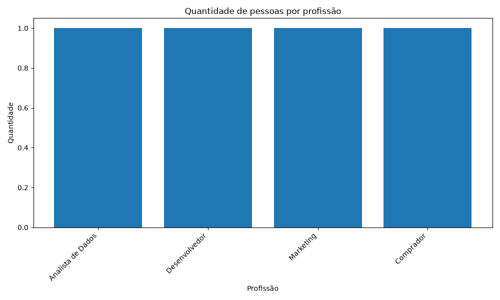

# Desafio Engenheiro Jr.

Este é o meu primeiro projeto desenvolvido durante a Pós-Graduação em Engenharia de Dados e Inteligência Artificial.

## Sobre o projeto

Este projeto foi criado para praticar conceitos iniciais de programação, Engenharia de Dados, Git e GitHub utilizando Python.

O sistema permite coletar informações de várias pessoas, armazenar os registros em um arquivo CSV e realizar uma análise simples dos dados cadastrados.

## Funcionalidades

- Cadastro de nome
- Cadastro de idade
- Cadastro de profissão
- Cadastro de várias pessoas em uma única execução
- Armazenamento dos dados em arquivo CSV
- Leitura automática da base de dados
- Cálculo da quantidade de pessoas cadastradas
- Cálculo da média de idade
- Identificação da menor idade
- Identificação da maior idade
- Contagem de pessoas por profissão
- Geração automática de gráfico
- Arquivo CSV compatível com Excel

## Tecnologias utilizadas

- Python
- Git
- GitHub
- CSV
- Matplotlib

## Estrutura do projeto

- `main.py` → responsável pela coleta e armazenamento dos dados
- `analise.py` → responsável pela leitura e análise dos dados
- `dados.csv` → base de dados utilizada pelo projeto
- `grafico_profissoes.png` → gráfico gerado a partir dos dados
- `requirements.txt` → lista de dependências necessárias
- `README.md` → documentação do projeto

## Fluxo do projeto

O funcionamento do projeto segue este fluxo:

1. O usuário executa o arquivo `main.py`
2. O programa solicita nome, idade e profissão
3. Os dados são armazenados no arquivo `dados.csv`
4. O arquivo `analise.py` lê a base de dados
5. O programa calcula informações sobre os registros
6. Um gráfico é gerado automaticamente

## Exemplo de análise

O programa consegue apresentar informações como:

- Quantidade total de pessoas
- Média de idade
- Menor idade cadastrada
- Maior idade cadastrada
- Quantidade de registros por profissão

## Visualização dos dados

O projeto também gera automaticamente um gráfico com a quantidade de pessoas por profissão.



## Como executar o projeto

Primeiro, instale as dependências:

```bash
pip install -r requirements.txt
```

Para cadastrar pessoas:

```bash
python main.py
```

Para analisar os dados e gerar o gráfico:

```bash
python analise.py
```

## Conceitos praticados

Durante o desenvolvimento deste projeto pratiquei:

- Variáveis em Python
- Entrada de dados com `input`
- Estruturas condicionais com `if`
- Estruturas de repetição com `while`
- Leitura e escrita de arquivos
- Manipulação de arquivos CSV
- Estruturas de dados
- Cálculo de média
- Análise simples de dados
- Visualização de dados
- Uso da biblioteca Matplotlib
- Versionamento com Git
- Criação de commits
- GitHub
- Documentação de projetos

## Próximas evoluções

Como próximos passos, o projeto poderá receber:

- Validação dos dados informados
- Novos tipos de análise
- Mais gráficos
- Organização dos dados com Pandas
- Interface para facilitar o cadastro
- Banco de dados

## Status

Projeto concluído e em evolução.